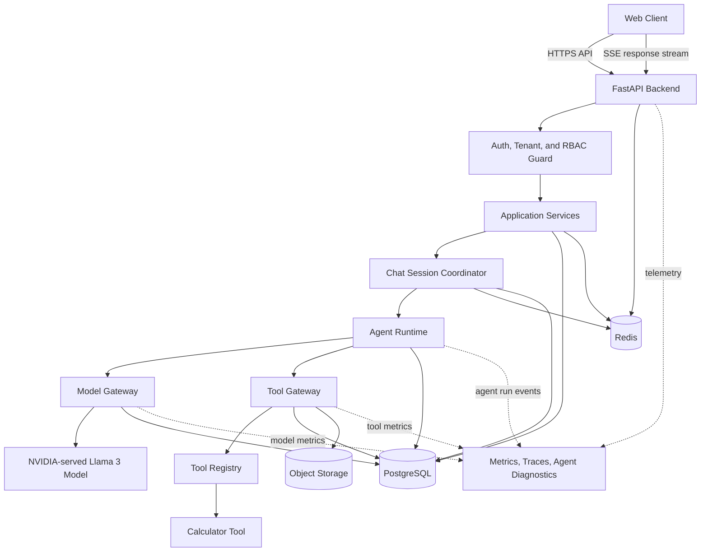
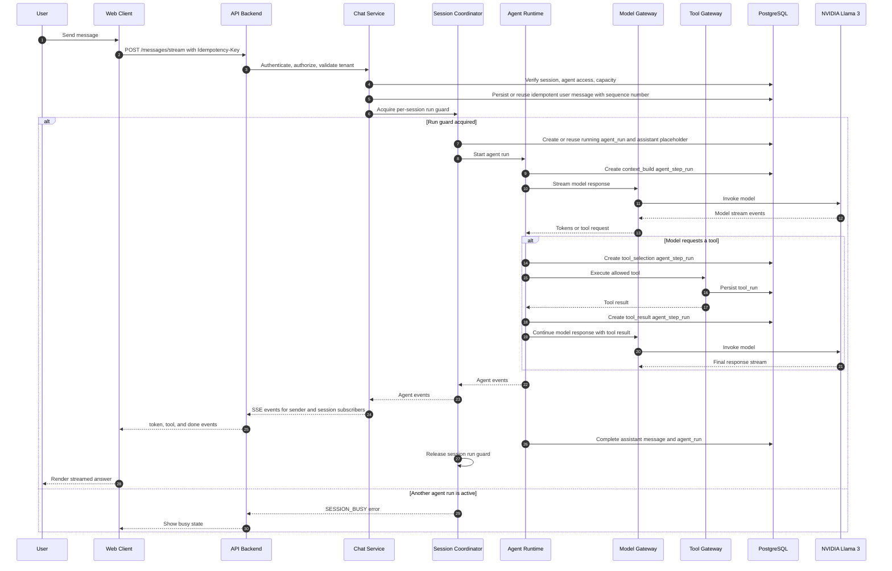
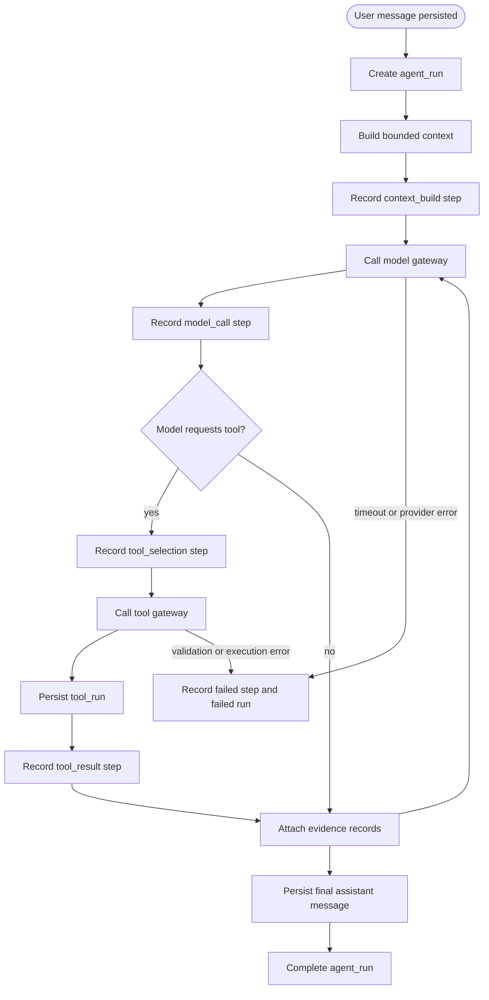

# Mini ChatGPT System Design

## 1. Purpose

Mini ChatGPT is an AI-first chat platform that lets companies register AI agents and let employees use those agents through chat sessions. The system is intended to demonstrate how an AI agent can be integrated into a production-style chat service with conversation persistence, streaming responses, tool execution, and multi-tenant controls.

This document is for design review before implementation.

## 2. Requirements

### 2.1 Functional Requirements

- A company can register for the platform.
- Each company has a super account for company-level administration.
- A company can register up to 20 agents.
- Employees can log in to the chat service.
- Employees can create and join chat sessions.
- Each chat session is associated with exactly one agent.
- A chat session should target up to 100 concurrent users; the first version can use a configurable lower cap if needed.
- Shared-session messages are ordered by a server-assigned sequence number.
- Each shared session runs at most one active agent run at a time; the first version rejects or disables additional sends while the agent is responding.
- Users can send messages to the session agent.
- The agent can respond conversationally.
- The agent can execute approved user tasks through tools.
- Conversations and messages are persisted.
- Users can view previous chat sessions and message history.
- Administrators can manage company agents and employee access.
- Administrators can assign agent access by user in the first version; team-based access can be added later.
- Users can request a chat session. Self-service agent access requests can be added after the first version.
- Administrators can view basic company-level metrics for agents, chat sessions, users, model usage, tool usage, latency, errors, and agent runs.
- Administrators can inspect agent run step timelines for debugging and audit. Full replay can be added after the first version.
- Each agent run records its reasoning and execution steps at a traceable step level.
- Each agent run records an evidence list that links inputs, model outputs, tool results, and final responses. Evidence graphs can be added later.

### 2.2 Non-Functional Requirements

- The platform should support up to 100 companies in total for the initial target scope.
- Chat response latency target is less than 1000 ms for first response/token under normal conditions.
- Availability target is 99%.
- API keys and provider credentials must never be exposed to clients.
- The system must isolate company data by tenant.
- The system should support streaming assistant responses.
- The system should make agent/tool execution auditable.
- The agent runtime must enforce bounded agentic loop limits so a run cannot call the model or tools indefinitely.

## 3. Assumptions

- The initial target is up to 100 total companies. They do not need to all be active at the same time.
- The less than 1000 ms latency target applies to first-token latency, because full answer completion depends on model length and tool execution time.
- The first model provider is an NVIDIA-served free Llama 3 model, accessed through the model gateway.
- A chat session has one active agent, but many users may participate in the same session.
- Shared multi-user chat sessions are in scope for the first version, but concurrent sends are blocked while the session agent is responding.
- Password-based login is acceptable for the first version.
- Tool execution is server-side only and limited to an allowlisted tool registry.
- The first tool is a simple calculator.
- Administrators assign agent access by user in the first version. Team-based access and self-service access requests are later enhancements.
- The first implementation can use a single deployable backend service before splitting into separate services.

## 4. High-Level Architecture



## 5. Recommended Initial Stack

- Frontend: React, TypeScript, Vite
- Backend: Python, FastAPI
- Database: PostgreSQL
- Cache and coordination: Redis
- Streaming: Server-Sent Events for assistant response streams
- Auth: password-based login with JWT access tokens and refresh tokens
- ORM and migrations: SQLAlchemy plus Alembic
- Background work: Celery, RQ, or FastAPI background workers for the first version
- Observability: structured logs, request IDs, metrics, and basic tracing
- Initial model: NVIDIA-served free Llama 3 model behind the model gateway

For local development, Docker Compose should run PostgreSQL, Redis, and the backend. SQLite is acceptable only for throwaway prototypes, but PostgreSQL is the better default because this system is multi-tenant and session-oriented.

## 6. Core Domains

### 6.1 Company

A company is the tenant boundary. All users, agents, chat sessions, messages, and tool executions belong to one company.

Responsibilities:

- Own tenant configuration.
- Own billing or quota metadata in future versions.
- Enforce the limit of 20 agents per company.

### 6.2 User

Users authenticate into the platform. A user belongs to one company in the first version.

Roles:

- `SUPER_ADMIN`: company super account, can manage agents and users.
- `EMPLOYEE`: can use available agents and chat sessions.

### 6.3 Agent

An agent is a company-owned configuration that wraps a model, system prompt, available tools, and safety settings.

Agent fields include:

- Name
- Description
- System prompt
- Model configuration
- Tool allowlist
- Temperature and generation limits
- Enabled/disabled status
- Access assignments by user

### 6.4 Chat Session

A chat session is a shared conversation space associated with exactly one agent.

Session responsibilities:

- Track active participants.
- Enforce a configurable concurrent-user cap, targeting 100 users per session.
- Store message history.
- Assign monotonic message sequence numbers.
- Serialize agent runs so only one run is active in a session at a time.
- Reject or disable additional sends while a session agent is already responding.
- Broadcast user messages, stream events, and final responses to active participants.
- Route user messages to the configured agent.
- Require the user to have access to the session agent.
- Allow admins to grant user access to the session agent.

### 6.5 Message

A message is a persisted chat event.

Message roles:

- `user`
- `assistant`
- `system`
- `tool`

Message status:

- `pending`
- `streaming`
- `complete`
- `failed`

### 6.6 Tool Execution

A tool execution records an agent-initiated server-side action.

Tool execution must capture:

- Tool name
- Input arguments
- Output result or error
- Actor user
- Agent
- Session
- Execution status
- Timing metadata

### 6.7 Agent Run

An agent run is the full execution trace triggered by one user message. It connects the user message, assistant response, model calls, tool calls, intermediate reasoning steps, and evidence used to produce the answer.

Agent run responsibilities:

- Provide an inspectable audit trail.
- Track latency and status at the whole-run level.
- Group all agent step runs for one user request.
- Link evidence records to the final assistant response.

### 6.8 Agent Step Run

An agent step run is one ordered step inside an agent run.

Step types:

- `context_build`
- `model_call`
- `tool_selection`
- `tool_call`
- `tool_result`
- `final_response`
- `error`

Step run responsibilities:

- Capture step input and output summaries.
- Link to a model request or tool run when applicable.
- Preserve enough metadata for diagnostics and debugging without exposing secrets.
- Record timing, status, and error details.

## 7. Request Flow

### 7.1 User Sends A Message



### 7.2 Agentic Loop



### 7.3 Streaming Protocol

Use Server-Sent Events for the first version because the primary streaming direction is backend to browser.

Example events:

```text
event: message_started
data: {"message_id":"msg_123"}

event: agent_run_started
data: {"agent_run_id":"run_123","message_id":"msg_123"}

event: token
data: {"message_id":"msg_123","text":"Hello"}

event: tool_started
data: {"tool_run_id":"tool_123","tool_name":"search"}

event: tool_completed
data: {"tool_run_id":"tool_123"}

event: agent_step_completed
data: {"agent_run_id":"run_123","step_run_id":"step_123","step_type":"model_call"}

event: message_completed
data: {"message_id":"msg_123","agent_run_id":"run_123"}

event: error
data: {"message_id":"msg_123","agent_run_id":"run_123","code":"MODEL_TIMEOUT","message":"The model request timed out."}
```

## 8. API Design

### 8.1 Authentication

```text
POST /api/auth/login
POST /api/auth/logout
POST /api/auth/refresh
GET  /api/auth/me
```

### 8.2 Companies

```text
POST /api/companies
GET  /api/companies/current
PATCH /api/companies/current
```

### 8.3 Users

```text
GET  /api/users
POST /api/users/invite
PATCH /api/users/{user_id}
```

### 8.4 Agents

```text
GET    /api/agents
POST   /api/agents
GET    /api/agents/{agent_id}
PATCH  /api/agents/{agent_id}
DELETE /api/agents/{agent_id}
GET    /api/agents/{agent_id}/metrics
GET    /api/agents/{agent_id}/access
PUT    /api/agents/{agent_id}/access
```

Rules:

- Only company admins can create, update, or delete agents.
- Backend enforces max 20 active agents per company.
- Employee users can list enabled agents they have access to.
- Admins assign agent access by user in the first version.

### 8.5 Future Agent Access Requests

```text
GET   /api/agent-access-requests
POST  /api/agent-access-requests
PATCH /api/agent-access-requests/{request_id}
```

Rules:

- Self-service access requests are a later enhancement.
- In the first version, admins assign user access directly.
- When added, approved requests create or update user/team agent access assignments.

### 8.6 Chat Sessions

```text
GET    /api/chat-sessions
POST   /api/chat-sessions
GET    /api/chat-sessions/{session_id}
PATCH  /api/chat-sessions/{session_id}
DELETE /api/chat-sessions/{session_id}
GET    /api/chat-sessions/{session_id}/metrics
```

Rules:

- A session must reference one enabled agent.
- Users can create a session only for an agent they can access.
- A session uses a configurable concurrent participant cap, targeting 100 active participants.

### 8.7 Messages

```text
GET  /api/chat-sessions/{session_id}/messages
POST /api/chat-sessions/{session_id}/messages
GET  /api/chat-sessions/{session_id}/messages/{message_id}/stream
```

Alternative first implementation:

```text
POST /api/chat-sessions/{session_id}/messages/stream
```

This single endpoint persists the user message and streams the assistant response in one request.

Message send rules:

- `POST` message endpoints require an `Idempotency-Key` header. The first-party frontend generates a UUID per user send action and reuses it on retries.
- The backend assigns a monotonic `sequence_number` within the chat session.
- User messages are persisted immediately.
- If the session agent is already responding, the backend returns `SESSION_BUSY` and does not start another agent run.
- Stream events are sent to the sending client and may also be broadcast to other active session participants.

### 8.8 Agent Runs And Diagnostics

```text
GET /api/agent-runs
GET /api/agent-runs/{agent_run_id}
GET /api/agent-runs/{agent_run_id}/steps
GET /api/agent-runs/{agent_run_id}/evidence
GET /api/agent-runs/{agent_run_id}/diagnostics
```

Rules:

- Admins can inspect all company agent runs.
- Employees can inspect agent runs for sessions they can access, with sensitive internal fields redacted.
- The first version returns a step timeline, model/tool event summaries, evidence list, and final response metadata. Full replay reconstruction can be added later.

### 8.9 Company Metrics

```text
GET /api/metrics/company
GET /api/metrics/agents
GET /api/metrics/chat-sessions
GET /api/metrics/tool-runs
GET /api/metrics/model-usage
```

Metrics endpoints are admin-only in the first version.

## 9. Data Model

### 9.1 Tables

```text
companies
  id
  name
  status
  created_at
  updated_at

users
  id
  company_id
  email
  password_hash
  role
  status
  created_at
  updated_at

agents
  id
  company_id
  name
  description
  system_prompt
  model_provider
  model_name
  model_config_json
  loop_config_json
  tool_allowlist_json
  status
  created_by
  created_at
  updated_at

agent_access_assignments
  id
  company_id
  agent_id
  user_id
  granted_by
  created_at

chat_sessions
  id
  company_id
  agent_id
  title
  status
  last_sequence_number
  created_by
  created_at
  updated_at

chat_session_participants
  id
  company_id
  session_id
  user_id
  joined_at
  last_seen_at
  status

messages
  id
  company_id
  session_id
  user_id
  sequence_number
  idempotency_key
  request_hash
  role
  content
  status
  error_code
  metadata_json
  created_at
  updated_at

agent_runs
  id
  company_id
  session_id
  agent_id
  triggering_message_id
  assistant_message_id
  idempotency_key
  status              # running | complete | failed | partial
  loop_limits_json
  loop_counters_json
  first_token_at
  started_at
  completed_at
  error_code
  diagnostic_snapshot_json
  metrics_json
  created_at

agent_step_runs
  id
  company_id
  agent_run_id
  step_index
  loop_iteration
  step_type           # context_build | model_call | tool_selection | tool_call | tool_result | final_response | error
  status
  input_summary
  output_summary
  input_json
  output_json
  model_request_id
  tool_run_id
  evidence_ids_json
  started_at
  completed_at
  error_code
  created_at

model_requests
  id
  company_id
  agent_run_id
  step_run_id
  provider
  model_name
  request_summary
  response_summary
  prompt_tokens
  completion_tokens
  total_tokens
  first_token_at
  started_at
  completed_at
  status
  error_code
  created_at

tool_runs
  id
  company_id
  session_id
  agent_id
  agent_run_id
  step_run_id
  message_id
  user_id
  tool_name
  arguments_json
  result_json
  status
  error_code
  started_at
  completed_at
  created_at

agent_run_evidence
  id
  company_id
  agent_run_id
  step_run_id
  evidence_type       # user_message | conversation_context | model_output | tool_result | final_response
  source_type
  source_id
  content_summary
  content_hash
  metadata_json
  created_at

```

### 9.2 Indexes

```text
users(company_id, email)
agents(company_id, status)
agent_access_assignments(company_id, agent_id, user_id)
chat_sessions(company_id, created_at)
chat_sessions(company_id, agent_id)
chat_session_participants(company_id, session_id, status)
messages(session_id, created_at)
messages(company_id, session_id, created_at)
messages(company_id, session_id, sequence_number) unique
messages(company_id, session_id, user_id, idempotency_key) unique
agent_runs(company_id, session_id, created_at)
agent_runs(company_id, agent_id, created_at)
agent_runs(company_id, session_id, status, created_at)
agent_runs(company_id, session_id) unique where status = running
agent_runs(company_id, triggering_message_id) unique
agent_step_runs(company_id, agent_run_id, step_index)
model_requests(company_id, agent_run_id, created_at)
tool_runs(company_id, session_id, created_at)
tool_runs(company_id, agent_id, created_at)
tool_runs(company_id, agent_run_id, created_at)
agent_run_evidence(company_id, agent_run_id, created_at)
```

## 10. Agent Runtime Design

The agent runtime should be isolated from API routes.

Primary interface:

```python
class AgentRuntime:
    async def stream_response(
        self,
        company_id: str,
        session_id: str,
        user_message_id: str,
    ) -> AsyncIterator[AgentEvent]:
        ...
```

Responsibilities:

- Load session, agent, and recent messages.
- Build model input from the agent system prompt and conversation history.
- Apply context window limits.
- Apply agentic loop limits.
- Create an `agent_run` for each user message.
- Create `agent_step_runs` for context building, model calls, tool selection, tool execution, and final response.
- Call the model gateway for reasoning/model inference.
- Stream tokens as `AgentEvent` values.
- Detect model-requested tool calls.
- Call the tool gateway for validated tool execution.
- Continue model generation after tool results when needed.
- Attach evidence records to the agent run.
- Persist final assistant message.
- Persist diagnostic snapshots and run metrics.

The runtime should not know about HTTP. API routes should translate runtime events into SSE events.

### 10.1 Agentic Loop Limits

The agent runtime owns loop limit enforcement. The model gateway and tool gateway enforce their own timeouts and retries, but they do not decide whether an agent run may continue looping.

Default first-version limits:

```text
max_agent_steps = 8
max_model_calls_per_run = 4
max_tool_calls_per_run = 3
max_same_tool_calls_per_run = 2
max_run_duration_seconds = 60
```

Definitions:

- `max_agent_steps`: maximum number of persisted `agent_step_runs` for one `agent_run`.
- `max_model_calls_per_run`: maximum number of model gateway calls in one run.
- `max_tool_calls_per_run`: maximum total tool gateway calls in one run.
- `max_same_tool_calls_per_run`: maximum calls to the same tool name in one run.
- `max_run_duration_seconds`: wall-clock duration limit from `agent_run.started_at`.

Configuration:

- Platform defaults come from backend settings.
- Agent-specific overrides can be stored in `agents.loop_config_json`.
- The runtime writes the effective limits into `agent_runs.loop_limits_json` at run start.
- The runtime writes observed counters into `agent_runs.loop_counters_json` during and after execution.

Enforcement:

- Before creating a new step, the runtime checks `max_agent_steps` and `max_run_duration_seconds`.
- Before calling the model gateway, the runtime checks `max_model_calls_per_run`.
- Before calling the tool gateway, the runtime checks `max_tool_calls_per_run` and `max_same_tool_calls_per_run`.
- If a limit is exceeded, the runtime creates a final `error` step with `error_code = AGENT_LOOP_LIMIT_EXCEEDED`.
- If no final answer has been produced, the runtime marks the assistant message and `agent_run` as `failed`.
- If some assistant content was already streamed, the runtime marks the run as `partial` and emits an SSE `error` event.
- Diagnostics must show which limit stopped the run and the counter values at the time of failure.

## 11. Model Gateway

The model gateway is the single boundary between the agent runtime and model providers. It hides vendor-specific APIs, standardizes model events, records model request metrics, and keeps provider credentials out of application services.

```python
class ModelGateway:
    async def stream_chat(
        self,
        agent_run_id: str,
        step_run_id: str,
        messages: list[ModelMessage],
        tools: list[ModelTool],
        config: ModelConfig,
    ) -> AsyncIterator[ModelEvent]:
        ...
```

Responsibilities:

- Route requests to the configured model provider.
- Support the NVIDIA-served free Llama 3 model for the first version.
- Validate the exact NVIDIA endpoint, streaming behavior, rate limits, and tool-calling support before Milestone 4 implementation.
- If the selected model endpoint does not support native tool calls, normalize a structured JSON tool-intent format produced by the model prompt.
- Normalize provider-specific stream events.
- Record `model_requests` rows.
- Capture first-token latency, completion latency, token counts, status, and errors.
- Enforce provider timeouts and retry policy.
- Redact secrets from persisted request and response summaries.

The first implementation can support only the NVIDIA-served Llama 3 integration, but the gateway should keep provider-specific code behind a provider adapter interface.

## 12. Tool Gateway

The tool gateway is the single boundary between the agent runtime and executable tools. It validates tool calls, enforces allowlists, records audit data, and returns normalized tool results.

```python
class ToolGateway:
    async def execute_tool(
        self,
        agent_run_id: str,
        step_run_id: str,
        tool_name: str,
        arguments: dict,
        context: ToolContext,
    ) -> ToolResult:
        ...
```

Responsibilities:

- Check the tool exists in the server-side registry.
- Check the session agent is allowed to use the tool.
- Validate arguments against the tool schema.
- Execute the tool with timeout and output size limits.
- Persist `tool_runs` rows.
- Emit tool telemetry and evidence records.
- Return normalized success or failure results.

## 13. Tool System

Tools should be registered server-side.

```python
class Tool:
    name: str
    description: str
    input_schema: dict

    async def execute(self, arguments: dict, context: ToolContext) -> ToolResult:
        ...
```

Tool safety rules:

- Only registered tools can run.
- Agent configuration must explicitly allow each tool.
- Tool arguments must be validated before execution.
- Tools must have timeouts.
- Tool outputs should be size-limited.
- Tool calls must be persisted for auditability.
- External side-effect tools require stricter confirmation flows in later versions.

First demo tool:

- Calculator

## 14. Concurrency And Scaling

### 14.1 Session Capacity

Each chat session targets up to 100 concurrent users. The first implementation can use a lower configurable cap while the product is being validated.

Implementation approach:

- Track active participants in Redis with TTL heartbeats.
- Refresh heartbeat from the client while the session is open.
- Persist participant records in PostgreSQL for audit/history.
- Reject session join when active participant count is at or above the configured cap.
- If Redis is unavailable, fail new joins closed and show session presence as degraded.
- Existing admitted participants can continue using the session when PostgreSQL and the backend are healthy.

### 14.2 Shared Session Message Ordering

Shared sessions can have many viewers, but the first version processes one user message at a time.

Implementation approach:

- Assign `messages.sequence_number` inside a PostgreSQL transaction.
- Require an idempotency key for each user message.
- Use a PostgreSQL partial unique index on running `agent_runs` as the source-of-truth run guard.
- If a session already has a running agent run, new user sends return `SESSION_BUSY`.
- The frontend should disable the composer while the session agent is responding.
- Broadcast accepted user messages immediately, then broadcast `agent_run_started`, token, tool, and completion events.
- FIFO queueing for concurrent sends can be added later if product usage requires it.

### 14.3 Chat Throughput

The most expensive operation is model generation. The backend should:

- Stream first token as soon as available.
- Apply per-user and per-company rate limits.
- Limit max input length and max output tokens.
- Use request timeouts and cancellation.
- Avoid loading unbounded message history.

### 14.4 Horizontal Scaling

The backend can scale horizontally if:

- PostgreSQL is the source of truth.
- Redis stores shared session presence and rate limits.
- Streaming requests are stateless after they have loaded session context.
- Tool execution state is persisted.

## 15. Latency Strategy

Target: less than 1000 ms first-token latency under normal conditions.

Design choices:

- Use streaming responses.
- Keep prompt context bounded.
- Cache agent configuration.
- Keep database queries indexed and small.
- Send `message_started` before model completion.
- Use model/provider settings optimized for interactive latency.

Risks:

- External LLM provider latency may exceed target.
- Tool execution may exceed target.
- Long conversation context increases prompt processing time.

Mitigations:

- Define first-token latency separately from full completion latency.
- Emit tool progress events.
- Set tool and model timeouts.
- Allow faster model choices per agent.

## 16. Availability Strategy

Target: 99% availability.

Initial approach:

- Keep the first version operationally simple.
- Use managed PostgreSQL and Redis in hosted environments.
- Add health checks.
- Add request timeouts.
- Fail gracefully on provider errors.
- Store failed assistant messages with retry metadata.

Important failure modes:

- Model provider unavailable.
- Database unavailable.
- Redis unavailable.
- Long-running tool times out.
- Client disconnects during stream.

## 17. Failure Modes And Resilience

The system should fail in ways that are visible, auditable, and recoverable. A failed or partial agent run must leave enough persisted state to explain what happened and allow a user or admin to retry safely.

### 17.1 Failure Mode Matrix

| Failure mode | Detection | Resilience behavior | Persisted state |
| --- | --- | --- | --- |
| Model gateway timeout | Provider timeout or no stream event before deadline | Stop current model call, emit SSE `error`, mark run `failed` or `partial` | `model_requests.status = failed`, `agent_step_runs.error_code = MODEL_TIMEOUT` |
| Model provider unavailable | Provider connection error or 5xx response | Retry with bounded backoff if request is retryable, then fail gracefully | `model_requests.error_code = MODEL_PROVIDER_UNAVAILABLE` |
| Model returns malformed tool call | Tool-call parse or schema validation error | Do not execute tool, ask model once to repair if within loop limits, otherwise fail run | `agent_step_runs.error_code = INVALID_TOOL_CALL` |
| Tool validation failure | Tool gateway schema validation error | Reject tool call and return normalized tool error to runtime | `tool_runs.status = failed`, `error_code = TOOL_VALIDATION_FAILED` |
| Tool execution timeout | Tool gateway timeout | Stop tool execution, continue model once with tool error if useful, otherwise fail run | `tool_runs.error_code = TOOL_TIMEOUT` |
| Tool service unavailable | Tool registry or external dependency error | Return normalized tool failure and preserve audit trail | `tool_runs.error_code = TOOL_UNAVAILABLE` |
| Agentic loop limit exceeded | Runtime counter or duration check | Stop the loop and emit structured SSE error | `agent_runs.error_code = AGENT_LOOP_LIMIT_EXCEEDED` |
| Database unavailable | Connection failure or transaction failure | Return API error, avoid starting model/tool side effects when state cannot be persisted | No partial run should start unless initial transaction succeeds |
| Database transaction conflict | Serialization conflict or duplicate idempotency key | Retry safe transactions with bounded attempts; use idempotency keys for message send | Existing `messages` and `agent_runs` reused when idempotency key matches |
| Redis unavailable | Redis connection or heartbeat failure | Fail new joins closed and mark session presence degraded; existing admitted users can continue when PostgreSQL is healthy | API logs `REDIS_UNAVAILABLE`; session presence is marked degraded |
| Client disconnects during SSE | Server detects closed response stream | Cancel provider stream when possible; persist partial or failed assistant message | `messages.status = failed` or `agent_runs.status = partial` |
| Backend process crashes mid-run | Missing completion heartbeat or stale `running` run | Recovery job marks stale runs as failed or partial | `agent_runs.error_code = RUN_INTERRUPTED` |
| Auth/session expired | Token validation failure | Return 401 and avoid side effects | Security logs only, no agent run |
| Rate limit exceeded | Rate limiter rejects request | Return 429 with retry metadata | No agent run, request log includes `RATE_LIMITED` |
| Evidence write failure | Evidence persistence error | Complete the core chat response if message/run state is safe, and mark run diagnostics incomplete | `agent_runs.metrics_json.diagnostics_incomplete = true` |
| Optional metrics write failure | Aggregate metric error | Complete the core chat response and let metrics be recomputed later | Metrics recovery job recomputes from source tables |

### 17.2 Retry And Backoff Policy

Retries should be conservative because chat requests can trigger external side effects through tools.

- Retry model gateway calls only for retryable transport errors, rate-limit responses with retry hints, and transient 5xx responses.
- Retry model gateway calls only before the first token, tool request, or assistant content delta has been emitted.
- After streaming has started, do not retry inside the same run; mark the run `partial` or `failed` and let the user retry with a new request.
- Do not retry tool calls by default unless the tool is explicitly marked idempotent.
- Retry database transactions only when no external model or tool side effect has occurred inside the transaction.
- Use exponential backoff with jitter and a small maximum retry count.
- Record retry count and final retryability in `model_requests`, `tool_runs`, or `agent_step_runs`.

Default first-version retry limits:

```text
model_gateway_max_retries = 2
database_transaction_max_retries = 2
tool_gateway_max_retries = 0
```

### 17.3 Idempotency

The message send endpoint should require an idempotency key for each user message request.

Rules:

- Reusing the same idempotency key for the same user, session, and message body returns the existing message/run state.
- Reusing the same key with different request content returns a conflict.
- Tool calls that can create external side effects must include their own idempotency keys before they are allowed in future versions.
- The first calculator tool is deterministic and side-effect free, so it can be safely retried if needed.

### 17.4 Degraded Modes

The system should distinguish core chat availability from optional capabilities.

- If Redis is unavailable, allow already-admitted participants to continue chatting when PostgreSQL is healthy. New joins fail closed until Redis recovers.
- If metrics storage is delayed, continue serving chat and buffer or drop non-critical telemetry.
- If evidence persistence fails but core message/run state is safe, complete the chat response and mark diagnostics incomplete.
- If the model gateway is unavailable, do not create a fake assistant response. Store a failed assistant message with retry metadata.
- If the tool gateway is unavailable, the runtime may continue with a tool error only when the model can produce a useful response without the tool.

### 17.5 Recovery Jobs

Background recovery should run periodically.

- Mark stale `agent_runs.status = running` records as `failed` or `partial` after a timeout.
- Mark stale `messages.status = streaming` records as `failed`.
- Reconcile Redis session presence with persisted participants.
- Recompute missing aggregate metrics from source tables.
- Flag run diagnostics as incomplete when expected step/evidence records are missing.

### 17.6 User-Facing Error Behavior

The frontend should show concise, actionable states without exposing internal provider details.

- Model failures: "The assistant could not complete this response."
- Tool failures: "A tool failed while running this request."
- Loop-limit failures: "The assistant stopped after reaching its execution limit."
- Capacity failures: "This session is full."
- Auth failures: redirect to login.

Every user-visible failure should map to a stable backend error code for support and diagnostics.

## 18. Security

Security controls:

- Hash passwords with a modern password hashing algorithm.
- Use HTTPS in deployed environments.
- Use signed JWTs or managed identity sessions.
- Enforce tenant isolation on every database query.
- Enforce role-based access for admin actions.
- Keep provider API keys on the backend only.
- Validate all request bodies.
- Apply message length limits.
- Audit tool executions.
- Avoid logging full sensitive message content by default.

## 19. Observability

Capture:

- Request ID
- Company ID
- User ID
- Session ID
- Agent ID
- Model provider and model name
- First-token latency
- Total completion latency
- Token usage when available
- Tool execution duration and status
- Agent run ID
- Agent step run ID
- Agent step type and status
- Evidence count
- Error code and retryability

Minimum metrics:

- API error rate
- Chat first-token latency
- Chat completion latency
- Model provider error rate
- Active sessions
- Tool execution failures
- Company agent usage
- Chat session usage and concurrency
- Agent run success/failure rate
- Agent step duration by type
- Tool usage by agent
- Model token usage by company and agent

### 19.1 Agent Run View

The first version should expose an admin-facing agent run detail view for debugging and audit. A broader dashboard can be added later.

It should show:

- Agent runs filtered by company, agent, session, user, status, and time range.
- Per-run status, latency, token usage, tool calls, and error code.
- Ordered agent step runs.
- Model request summaries and timing.
- Tool run summaries and timing.
- Final assistant response metadata.

### 19.2 Agent Run Diagnostics

Agent run diagnostics reconstruct what happened during an agent run from persisted records at a practical step-summary level.

Diagnostics should include:

- Triggering user message.
- Bounded conversation context used by the runtime.
- Agent configuration snapshot.
- Ordered step timeline.
- Model request and response summaries.
- Tool arguments and results.
- Evidence list.
- Final assistant response.

Diagnostics must redact secrets and any tool output marked sensitive.

### 19.3 Evidence List

Each agent run should expose evidence as a list in the first version. Evidence graph support can be added later.

Evidence list:

- Ordered records used or produced during the run.
- Source type and source ID for each record.
- Content summary and hash.
- Step run that created or used the evidence.

Future evidence graph:

- Nodes are evidence records.
- Edges describe relationships such as `derived_from`, `supports`, `contradicts`, and `used_by`.
- The graph links the final response back to the user message, context, model outputs, and tool results that influenced it.

## 20. Frontend Design

Primary screens:

- Login
- Company admin dashboard
- Agent management
- Chat session list
- Chat session view
- Basic company metrics view
- Agent run detail view

Chat session view:

- Left sidebar for sessions and agents.
- Main message timeline.
- Participant indicator.
- Streaming assistant message state.
- Tool execution progress rows.
- Composer with send button and disabled/loading states.
- Error state with retry action.

Admin dashboard:

- Basic agent usage metrics.
- Basic chat session activity.
- Model usage and latency summary.
- Tool usage and error summary.
- Agent run list with detail links.

Frontend responsibilities:

- Keep auth token/session.
- Render messages and streaming events.
- Send heartbeat while inside a session.
- Respect server errors for session capacity and permissions.
- Avoid storing provider credentials.
- Render evidence list for agent run diagnostics.

## 21. Deployment Shape

Initial deployable units:

```text
frontend web app
backend API service
PostgreSQL
Redis
```

Future deployable units:

```text
agent worker service
model gateway service
tool execution worker service
tool gateway service
event gateway for WebSocket support
```

## 22. Resolved Review Decisions

- The first version starts with shared multi-user sessions.
- Password-based login is acceptable for the first version.
- The initial model is an NVIDIA-served free Llama 3 model behind the model gateway.
- The first tool is a simple calculator behind the tool gateway.
- The initial platform target is up to 100 total companies, not 100 companies per day.
- The 100-company target does not require every company to be active at the same time.
- Users can create chat sessions for agents they can access.
- Administrators assign agent access by user in the first version; team-based assignment is deferred.
